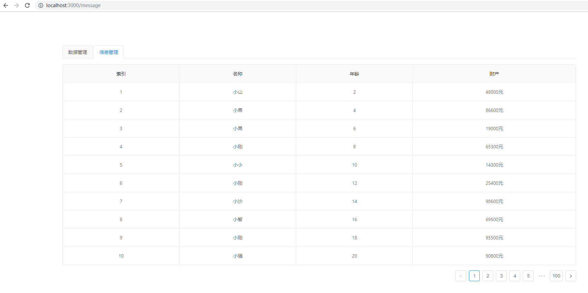
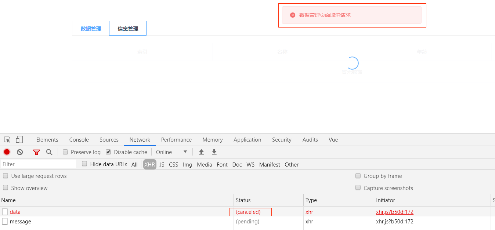
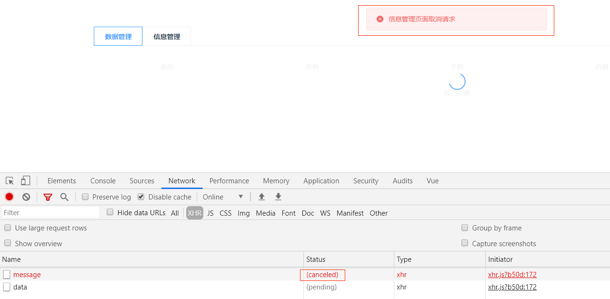
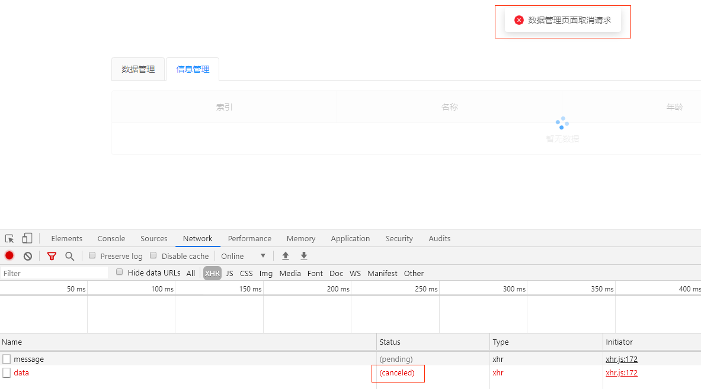
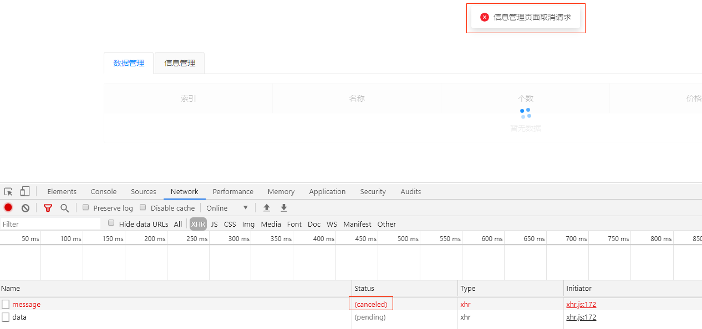

# vue和react中如何优雅地使用axios取消请求
## 运行步骤
1.先启动server
```
npm run server
```
2.查看react组件取消请求实践
```
npm run react-dev
```
3.查看vue组件取消请求实践
```
npm run vue-dev
```
## 前言
前端开发中，我们常常会遇到下面的场景：

当切换tab的时候，前一个组件内的请求还在进行，我们已经切换到了第二个tab，如果不去处理未完成的请求，会极大地影响页面性能，甚至导致后续的请求超时。



这样的场景尤其在一些切换频率较高的页面中会经常出现。

这样的问题可以归纳为：**组件销毁时如何取消请求？**

基本上解决这个问题，有2种思路：
- 1.设置超时时间，超时后请求会自动断开。
- 2.调用XMLHttpRequest实例的abort方法取消请求。

如果是用原生js实现的话，代码如下：
```
function request(method, url, data = null, timeout, callback){
      const xhr = new XMLHttpRequest();
      let timedout = false;
      const timer = setTimeout(function(){
               timedout = true;
               xhr.abort(); // 超时取消请求
      },timeout);
      xhr.open(method, url, true);
      xhr.send(data);
      xhr.onreadystatechange = function(){
         if(xhr.readyState !== 4){ return;}
         if(timedout){ return;}
         clearTimeout(timer);
         if(xhr.status === 200){
           callback(xhr.responseText);
         }
      };
}
```

接下来我们看看axios库如何取消请求。

## 1.axios取消请求
> Axios 的 cancel token API 基于cancelable promises proposal，它还处于第一阶段。

通过传递一个 executor 函数到 CancelToken 的构造函数来创建 cancel token，请求参数携带CancelToken实例，取消的时候调用cancel函数即可。
```
const CancelToken = axios.CancelToken;
let cancel;

axios.get('/user/12345', {
  cancelToken: new CancelToken(function executor(c) {
    // executor 函数接收一个 cancel 函数作为参数
    cancel = c;
  })
});

// 取消请求
cancel()
```
参考 [官方链接](http://www.axios-js.com/zh-cn/docs/#%E5%8F%96%E6%B6%88)

可以看出axios取消请求分为2步：
- 1.借助于axios.CancelToken生成实例、注册cancel函数，请求携带cancelToken参数。
- 2.取消请求时调用cancel方法。

**思路**：
<br>
由于vue和react项目都是以组件为单位的，在组件初始化阶段完成上述第1步（初始化），在组件销毁阶段我们完成第2步（取消请求），即可做到组件销毁时取消请求。

## 2.vue使用mixin取消请求
`vue`中`mixin`主要用来封装可复用功能，具体定义如下：
> 混入 (mixin) 提供了一种非常灵活的方式，来分发 Vue 组件中的可复用功能。一个混入对象可以包含任意组件选项。当组件使用混入对象时，所有混入对象的选项将被“混合”进入该组件本身的选项。

因此，我们可以将上述取消请求的逻辑封装到`mixin`中，在`created`阶段生成`cancelToken`实例、注册`cancel`方法，在`beforeDestroy`阶段调用cancel方法取消请求。
```
// cancelTokenMixin.js

import axios from 'axios';

const CancelToken = axios.CancelToken;

const cancelTokenMixin = {
  data () {
    return {
      cancelToken: null, // cancelToken实例
      cancel: null // cancel方法
    };
  },

  created () {
    // 初始化生成cancelToken实例，注册cancel方法
    this.cancelToken = new CancelToken(c => {
      this.cancel = c;
    });
  },

  beforeDestroy () {
    // 组件销毁阶段调用cancel方法取消请求
    this.cancel(`${this.pageName}取消请求`);
  }
};

export default cancelTokenMixin;
```
DataManage.vue组件和MessageManage.vue引用cancelTokenMixin。
```
// DataManage.vue

import cancelTokenMixin from '../mixin/cancelTokenMixin'

export default {
  name: 'DataManage',
  mixins: [cancelTokenMixin], // 引入mixin
  data () {
    ....
  },
  mounted () {
    this.getData()
  },
  method: {
    getData () {
      this.loading = true
      // 请求携带cancelToken参数
      axios.get('http://localhost:7000/data', { cancelToken: this.cancelToken }).then(res => {
        const data = res.data
        if (data.success) {
          this.allData = data.fruits
          this.changePage()
        }
      }).catch(err => {
        const message = err.message || '获取数据失败';
        console.log(message);
        this.$message({
          type: 'error',
          message
        })
      }).finally(() => {
        this.loading = false
      })
    },
    ....
  }
```


说明：
<br>
数据管理页面调用`http://localhost:7000/data`接口，信息管理页面调用`http://localhost:7000/message`接口。

从数据管理tab切换到信息管理tab时，data接口状态变为cancel状态，请求成功取消。


从信息管理tab切换到数据管理tab时，message接口状态变为cancel状态，请求也成功取消。


>总结：<br>
>在vue中可以将取消请求初始化的逻辑封装到mixin中，然后各组件引入mixin，request请求设置cancelToken参数即可。

## 3.react使用HOC组件取消请求
由于react官方不推荐使用mixin。因此，我们可以公共逻辑封装到公用方法中，然后封装到高阶组件中，业务组件引入高阶组件即可。

>高阶组件（HOC）是 React 中用于复用组件逻辑的一种高级技巧。HOC 自身不是 React API 的一部分，它是一种基于 React 的组合特性而形成的设计模式。

具体而言，高阶组件是参数为组件，返回值为新组件的函数。
```
const EnhancedComponent = higherOrderComponent(WrappedComponent);
```

公共方法生成`cancelToken`实例和`cancel`方法，实现如下：
```
// uilts/index.js
import axios from 'axios';

export const generateCancelToken = () => {
  let cancel = null;
  const cancelToken = new axios.CancelToken(c => {
    cancel = c;
  });
  return {
    cancel,
    cancelToken
  };
};
```

高阶组件`withCancelRequest`初始化阶段生成`cancelToken`实例和`cancel`方法，将`cancelToken`实例作为`prop`传递给包装组件，在`componentWillUnmount`阶段取消请求，具体实现如下：
```
import React, { Component } from 'react';
import { generateCancelToken } from '../utils/index';

function withCancelRequest (WrappedComponent, pageName) {
  return class extends Component {
    constructor(props) {
      super(props);
      // 初始化生成cancelToken实例和cancel方法
      const { cancel, cancelToken } = generateCancelToken();
      this.cancelToken = cancelToken;
      this.cancel = cancel;
    }
    componentWillUnmount () {
      // 组件销毁阶段调用cancel方法取消请求
      let message = '取消页面请求';
      if (pageName) {
        message = `${pageName}取消请求`;
      }
      this.cancel(message);
    }
    render () {
      // 将cancelToken传给包裹组件
      return <WrappedComponent cancelToken={this.cancelToken} />;
    }
  };
}

export default withCancelRequest;
```

> Tips：HOC组件的componentWillUnmount会先于包装组件的componentWillUnmount触发，在这时取消请求即可。

`class`组件DataManage引用`withCancelRequest`：
```
// DataManage.jsx

import withCancelRequest from '../hoc/withCancelRequest';
...

class DataManage extends Component {
  ...
  componentDidMount () {
    const { cancelToken } = this.props; // 取到传下来的cancelToken
    this.setState({
      loading: true
    });
    // 接口请求携带cancelToken
    axios.get('http://localhost:7000/data', { cancelToken }).then(res => {
      if (res.data && res.data.success) {
        const data = get(res, 'data.fruits', []);
        this.setState({
          data,
          loading: false
        });
      }
    }).catch(err => {
      const errMessage = err.message || '获取数据失败';
      console.log(errMessage);
      message.error(errMessage);
    });
  }
  ...
}

// 使用高阶组件包装业务组件
export default withCancelRequest(DataManage, '数据管理页面');
```
function组件MessageManage引用`withCancelRequest`：
```
// MesageManage.jsx

...
import withCancelRequest from '../hoc/withCancelRequest';

function MessageManageponent (props) {
  ...
  const { cancelToken } = props; // 取到传下来的cancelToken
  const getMessageData = () => {
    setLoading(true);
    // 接口请求携带cancelToken
    axios.get('http://localhost:7000/message', { cancelToken }).then(res => {
      if (res.data && res.data.success) {
        const data = get(res, 'data.message', []);
        setData(data);
        setLoading(false);
      }
    }).catch(err => {
      const errMessage = err.message || '获取数据失败';
      console.log(errMessage);
      message.error(errMessage);
    });
  };

  useEffect(getMessageData, []);
  
  ...
}

// 使用高阶组件包装业务组件
export default withCancelRequest(MessageManageponent, '信息管理页面');
```
数据管理页面仍然调用`http://localhost:7000/data`接口，信息管理页面调用`http://localhost:7000/message`接口。

从数据管理tab切换到信息管理tab时，data接口状态变为cancel状态，请求成功取消。


从信息管理tab切换到数据管理tab时，message接口状态变为cancel状态，请求成功取消。


## 4.总结
- 1.vue组件取消请求可以将业务逻辑封装到Mixin中，然后组件引入Mixin即可。
- 2.react组件取消请求通过HOC组件实现，业务组件使用HOC组件包装。

## 结语
以上就是博主关于react和vue组件销毁取消请求的一点小实践，觉得有收获的可以关注一波，点赞一波，码字不易，万分感谢。

[代码地址](https://github.com/dadaiwei/vue-react-cancelToken)（包含上述react和vue项目完整代码）